<div align="center">


# 🇮🇳 India eVisa 2.0 (भारत ई-वीजा)
### *A Next-Generation, Mobile-First Public Service Portal for International Visitors*

[](https://buildwhatmovesindia.com/)
[](https://openai.com/)
[](https://openai.com/)
[](https://platform.openai.com/)
[](https://nextjs.org/)
[](LICENSE)

<br />

**[Watch Demo Video](#-interactive-demo-video) • [Official Generated ETA Pass (PDF)](#-official-generated-eta-visa-pass) • [Visual Walkthrough Grid](#-application-walkthrough--screenshot-grid) • [Architecture](#-architecture--how-gpt-56-luna--gpt-56-terra-built-this)**

---

</div>

> **Disclaimer**: This is an **independent hackathon prototype** built for the **[Build What Moves India](https://buildwhatmovesindia.com/)** national initiative. It is not affiliated with the Government of India or the Ministry of Home Affairs. All passport data, OTPs, payments, and visa decisions shown are 100% simulated mock data.

---

## 🎯 Executive Summary & The Problem

Over **5 million international tourists, researchers, and business visitors** apply for an Indian e-Visa each year via the legacy portal (`indianvisaonline.gov.in`). While operationally robust, the current digital experience presents friction at every turn:

1. **Subcategory Overload**: 9 ambiguous visa subcategories dumped on screen 1 without upfront cost or validity guidance.
2. **Silent Document Rejection**: Strict photo and passport specifications (10KB–300KB, exact 350x350 pixels, white background) buried in modal FAQs — applicants find out about rejection **72 hours later**.
3. **Monolithic Form Wall**: 40+ manual inputs across multi-page HTML tables with 15-minute aggressive timeouts and confusing temporary application IDs.
4. **Exposed Gateway Plumbing**: Exposing raw SBI ePay vs Axis Bank pipes, 2.5%–3.5% transaction surcharges, and cryptic 3D-Secure error states to foreign travelers.
5. **Opaque "Under Process" Tracking**: Complete silence between submission and email decision with zero visibility into immigration milestones.

---

## ✨ The Solution: What We Built

**India eVisa 2.0** borrows the best-in-class UX paradigms from the **UK ETA (Gov.uk)** and **New Zealand NZeTA**, blending them into an India-centric design system:

* **🧭 Upfront 4-Question Eligibility Checker**: Tells applicants in 30 seconds if the 30-day e-Tourist Visa fits their trip, what 3 documents they need, and the exact transparent fee (**₹2,399 / $25 USD**) before touching any form.
* **🔍 AI Pre-Flight Document Inspector**: Powered by **GPT-5.6 Terra**, uploaded passport bio-pages and photos are evaluated in real-time. It catches glare, non-white backgrounds, tight crops, and validity < 6 months **before submission**, eliminating the #1 driver of visa rejections.
* **📱 One-Question-Per-Screen Wizard**: Engineered with **GPT-5.6 Luna** for mobile-first progressive disclosure with continuous autosave to session state, estimated time indicators, and keyboard accessibility.
* **💳 Single-Number Transparent Checkout**: One all-inclusive fee breakdown with ₹0 hidden gateway charges and simulated 1-click payment processing.
* **📍 Live Multi-Stage Status Tracker**: Visual 3-stage milestone progression (`Submitted` → `Under Review` → `Decision`) with an interactive **"Judge Time-Travel Mode"** to test simulated approvals instantly.
* **📄 Official PDF ETA Pass Generator**: Instant client-side generation of high-fidelity Electronic Travel Authorization certificates with Ashoka watermarks, QR verification codes, and barcodes.

---

## 🎥 Interactive Demo Video

Watch the complete end-to-end applicant journey in action:

https://github.com/satiricalguru/India-eVisa/raw/main/india-visa-demo.mp4

<div align="center">
  <video src="https://github.com/satiricalguru/India-eVisa/raw/main/india-visa-demo.mp4" controls width="100%" style="max-width: 860px; border-radius: 12px; box-shadow: 0 12px 36px rgba(0,0,0,0.18);">
    <p>Your browser does not support embedded videos. <a href="https://github.com/satiricalguru/India-eVisa/raw/main/india-visa-demo.mp4"><strong>Click here to play / download india-visa-demo.mp4</strong></a>.</p>
  </video>
  <br /><br />
  <a href="india-visa-demo.mp4"></a>
  &nbsp;&nbsp;
  <a href="India-eVisa-ETA-ETV-2026-98312.pdf"></a>
</div>

---

## 📄 Official Generated ETA Visa Pass

When an application is approved, the portal automatically generates a print-ready, high-fidelity **Electronic Travel Authorization (ETA)** document with security features, Ashoka emblem seal, QR verification code, and barcode.

<div align="center">
  <a href="India-eVisa-ETA-ETV-2026-98312.pdf">
    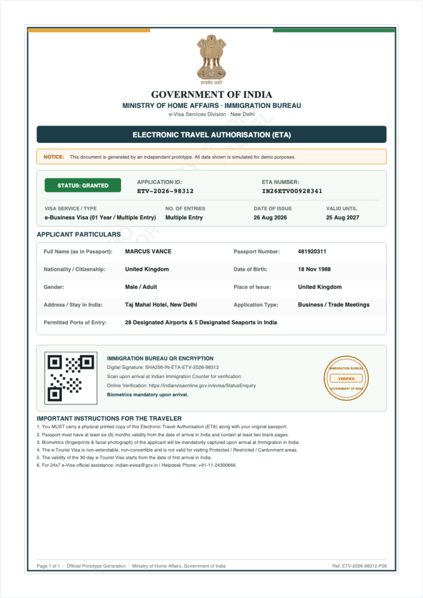
  </a>
  <br /><br />
  <p><em>Official Electronic Travel Authorization (ETA) Certificate generated by the platform.</em></p>
  <a href="India-eVisa-ETA-ETV-2026-98312.pdf">
    <strong>📥 Click here to open / download India-eVisa-ETA-ETV-2026-98312.pdf</strong>
  </a>
</div>

---

## 📸 Application Walkthrough & Screenshot Grid

<table width="100%">
  <tr>
    <td width="50%" align="center" valign="top">
      <a href="public/screenshots/01-landing-hero.png">
        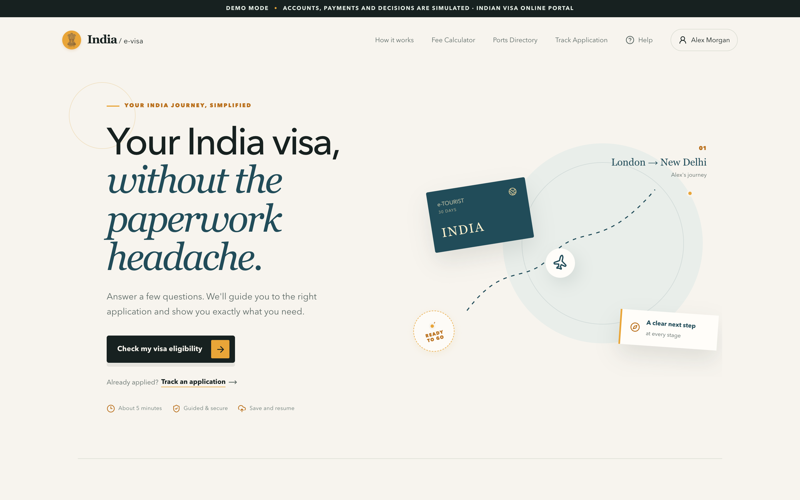
      </a>
      <p><strong>01. Modern Landing Page</strong><br /><em>Hero section with live route mapping & compliance banner</em></p>
    </td>
    <td width="50%" align="center" valign="top">
      <a href="public/screenshots/02-eligibility-checker.png">
        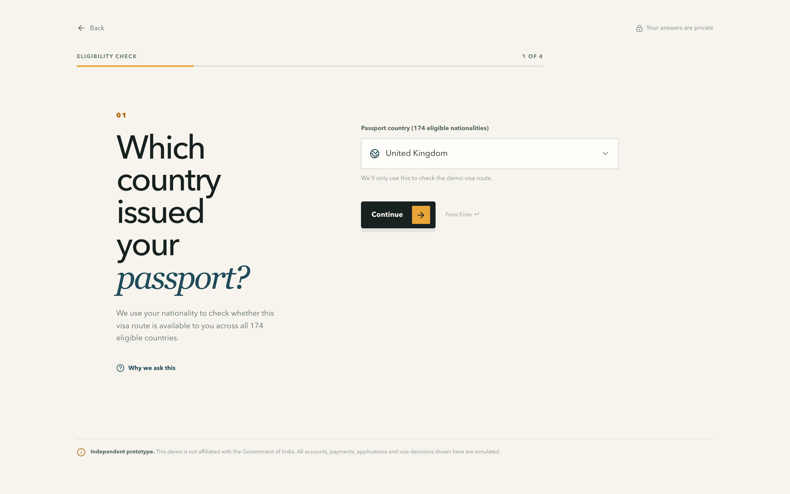
      </a>
      <p><strong>02. Upfront Eligibility Checker</strong><br /><em>4-question instant category & duration verification</em></p>
    </td>
  </tr>
  <tr>
    <td width="50%" align="center" valign="top">
      <a href="public/screenshots/03-eligibility-result.png">
        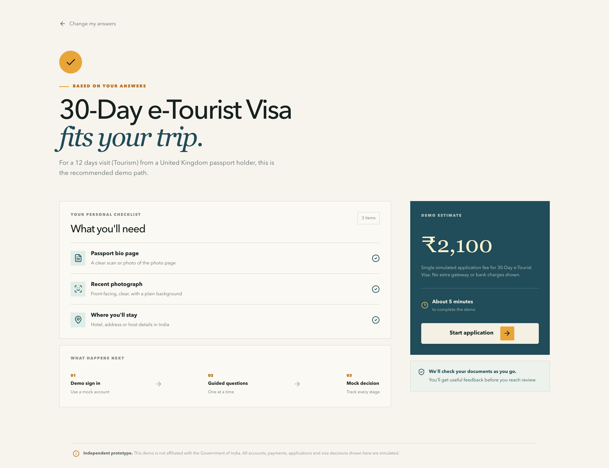
      </a>
      <p><strong>03. Personal Checklist & Fee Estimate</strong><br /><em>Tailored 3-item checklist & upfront transparent estimate</em></p>
    </td>
    <td width="50%" align="center" valign="top">
      <a href="public/screenshots/04-demo-login.png">
        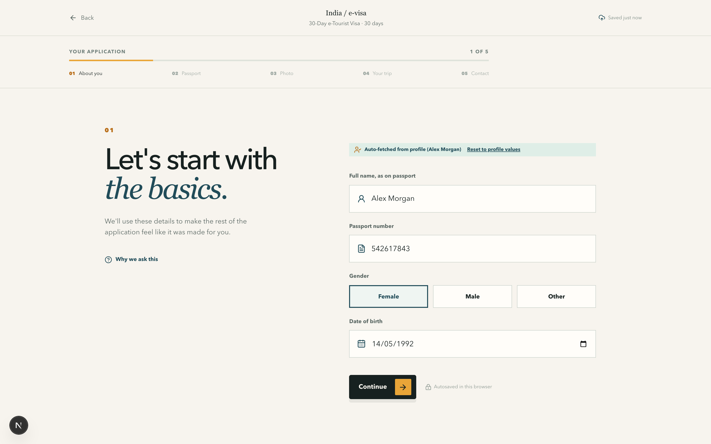
      </a>
      <p><strong>04. Demo Sign-in (Mock OTP)</strong><br /><em>One-click mock login with session autosave recovery</em></p>
    </td>
  </tr>
  <tr>
    <td width="50%" align="center" valign="top">
      <a href="public/screenshots/06-wizard-document-ai.png">
        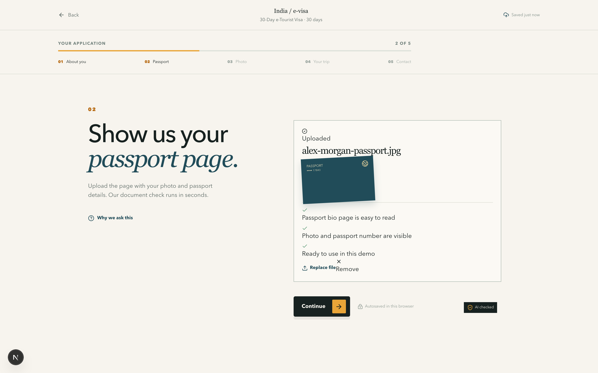
      </a>
      <p><strong>05. AI Passport Pre-Flight Check</strong><br /><em>GPT-5.6 Terra real-time MRZ & 6-month validity verification</em></p>
    </td>
    <td width="50%" align="center" valign="top">
      <a href="public/screenshots/07-wizard-photo-check.png">
        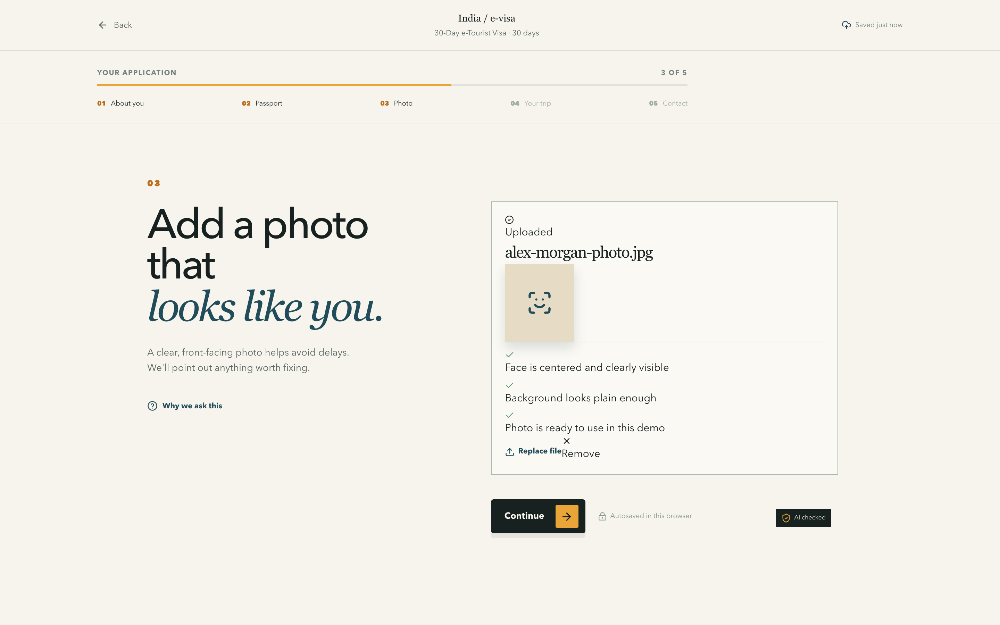
      </a>
      <p><strong>06. AI Photo Quality Inspection</strong><br /><em>Background color, glare & facial framing validation</em></p>
    </td>
  </tr>
  <tr>
    <td width="50%" align="center" valign="top">
      <a href="public/screenshots/08-review-summary.png">
        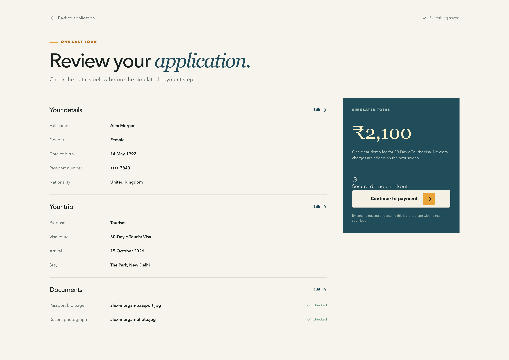
      </a>
      <p><strong>07. Application Summary Review</strong><br /><em>Comprehensive review with inline instant edit triggers</em></p>
    </td>
    <td width="50%" align="center" valign="top">
      <a href="public/screenshots/09-transparent-payment.png">
        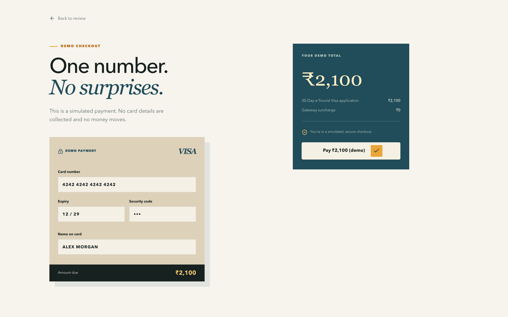
      </a>
      <p><strong>08. Unified Transparent Checkout</strong><br /><em>Single fee (₹2,399) with ₹0 gateway plumbing surcharges</em></p>
    </td>
  </tr>
  <tr>
    <td width="50%" align="center" valign="top">
      <a href="public/screenshots/10-live-tracking-under-review.png">
        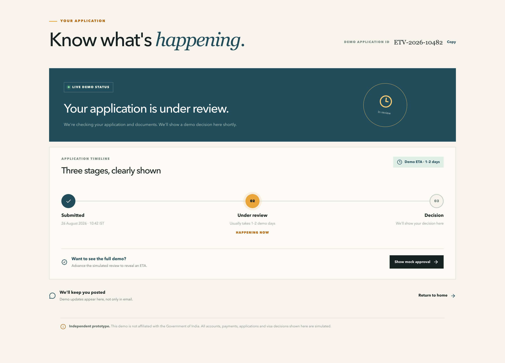
      </a>
      <p><strong>09. Live Status Tracker (Under Review)</strong><br /><em>Visual milestone timeline & Judge Fast-Forward button</em></p>
    </td>
    <td width="50%" align="center" valign="top">
      <a href="public/screenshots/11-live-tracking-approved.png">
        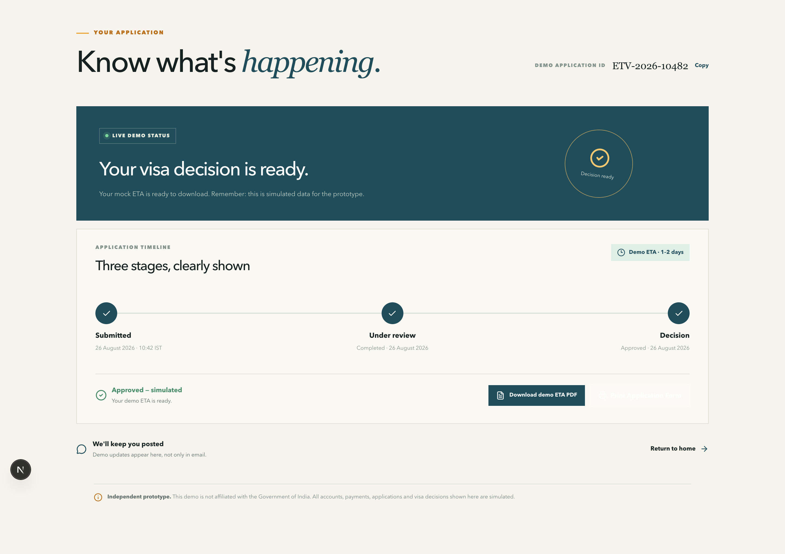
      </a>
      <p><strong>10. Simulated Instant Approval</strong><br /><em>Decision-ready status with 1-click PDF pass download</em></p>
    </td>
  </tr>
  <tr>
    <td width="50%" align="center" valign="top">
      <a href="public/screenshots/05-wizard-personal.png">
        
      </a>
      <p><strong>11. One-Question-Per-Screen Wizard</strong><br /><em>Mobile-first progressive disclosure with continuous autosave</em></p>
    </td>
    <td width="50%" align="center" valign="top">
      <a href="public/screenshots/12-fee-calculator-modal.png">
        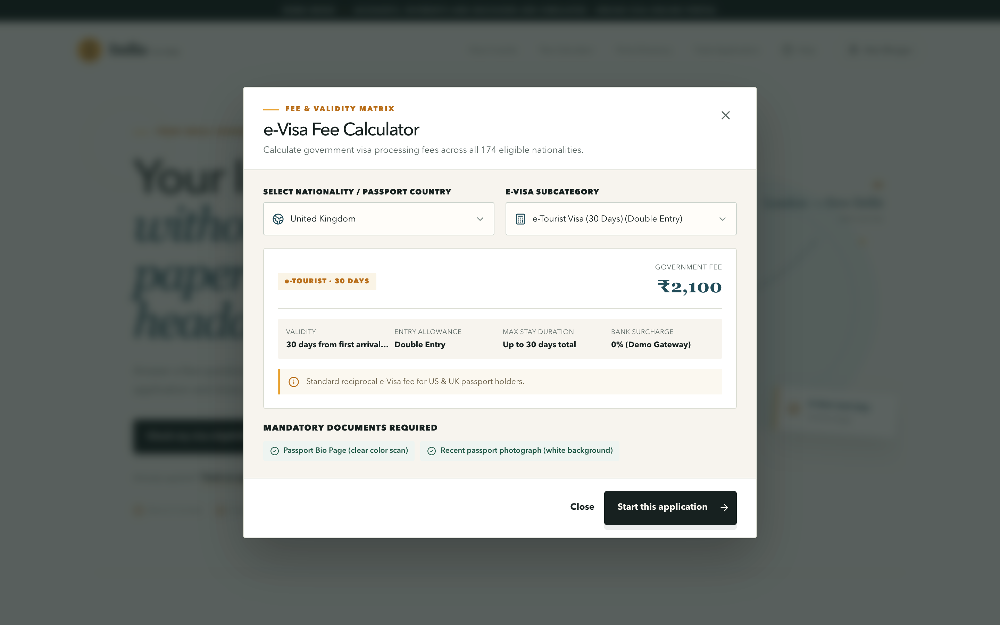
      </a>
      <p><strong>12. Dynamic Fee Calculator Modal</strong><br /><em>Multi-country reciprocity directory with zero-hidden cost logic</em></p>
    </td>
  </tr>
</table>

---

## 🏗️ Architecture & How GPT-5.6 Luna + GPT-5.6 Terra Built This

```
┌─────────────────────────────────────────────────────────────────────────────────────────────────┐
│                                   INDIA eVISA 2.0 ARCHITECTURE                                  │
├───────────────────────────────┬─────────────────────────────────┬───────────────────────────────┤
│ Layer                         │ Technology / Service            │ Purpose                       │
├───────────────────────────────┼─────────────────────────────────┼───────────────────────────────┤
│ Frontend Framework            │ Next.js 16 (App Router)         │ High-performance SSR & SPA    │
│ Architecture & State Engine   │ GPT-5.6 Luna                    │ Wizard state machine & schemas│
│ In-Product Vision AI          │ GPT-5.6 Terra                   │ Real-time doc & photo checks  │
│ Tooling & Build Acceleration  │ OpenAI Codex                    │ Prompt-to-code pipelines      │
│ Styling & UI Design System    │ Vanilla CSS + Tailwind CSS 4    │ Custom Indian Gov Design Sys  │
│ Iconography & Micro-Motion    │ Lucide React + CSS Keyframes    │ Fluid interactive feedback    │
│ Document Rendering Engine     │ Custom Canvas / Vector PDF Gen  │ Official ETA & receipt PDFs   │
│ Client Persistence            │ Browser SessionStorage API      │ Resilient autosave & recovery │
└───────────────────────────────┴─────────────────────────────────┴───────────────────────────────┘
```

### 🧠 The Dual AI Engine: GPT-5.6 Luna & GPT-5.6 Terra

This project was built and powered by a specialized combination of cutting-edge models:

1. **🏛️ GPT-5.6 Luna (Systems Architecture & Flow Engine)**:
   - Scaffolded the resilient, multi-step application wizard and session autosave state machine.
   - Built the zero-friction data contracts, responsive modal interfaces, and the interactive **Judge Time-Travel Mode**.
   - Authored the client-side vector PDF generation engines (`generateEtaPdf.ts`, `generateApplicationSummaryPdf.ts`, `generatePaymentReceiptPdf.ts`).

2. **👁️ GPT-5.6 Terra (Multimodal Vision & Document Intelligence)**:
   - Powers the real-time `/api/document-check` pre-flight inspection pipeline.
   - Evaluates passport bio-data (MRZ sharpness, 6-month validity, corner visibility).
   - Validates applicant portrait lighting, neutral expression, and plain background compliance.

3. **⚡ OpenAI Codex (Build Acceleration)**:
   - Rapidly generated boilerplate structures, TypeScript types, and checkpost lookup databases for all 31 immigration airports and 5 seaports.

---

## 🚀 Getting Started Locally

### Prerequisites
* **Node.js**: v18.18+ or v20+ / v22+
* **npm**: v9+ or v10+

### Installation & Run

```bash
# 1. Clone the repository
git clone https://github.com/satiricalguru/India-eVisa.git
cd India-eVisa

# 2. Install dependencies
npm install

# 3. (Optional) Configure OpenAI API Key for live AI Document Checks
# If omitted, the application uses realistic mock AI pre-flight responses!
export OPENAI_API_KEY="your-openai-api-key"
export OPENAI_DOCUMENT_MODEL="gpt-5.6-terra"

# 4. Start the development server
npm run dev
```

Open **[http://localhost:3000](http://localhost:3000)** in your browser to experience the application.

---

## 🏆 Hackathon Credits & Acknowledgements

* **Hackathon**: [Build What Moves India](https://buildwhatmovesindia.com/)
* **Systems Architecture & Logic**: Built with **GPT-5.6 Luna**
* **Multimodal Document Vision**: Powered by **GPT-5.6 Terra**
* **Tooling & Build Acceleration**: Accelerated by **OpenAI Codex**
* **Inspiration**: Gov.uk Design System (UK ETA) & Immigration New Zealand (NZeTA)
* **Author**: Jatin Pandey ([@satiricalguru](https://github.com/satiricalguru))

---

## 📜 License

Distributed under the **MIT License**. See [`LICENSE`](LICENSE) for more information.

<br />

<div align="center">
  <a href="https://openai.com/">
    <picture>
      <source media="(prefers-color-scheme: dark)" srcset="public/openai-logo-dark.png">
      <source media="(prefers-color-scheme: light)" srcset="public/openai-logo-light.png">
      
    </picture>
  </a>
  <br /><br />
  <p><em>Built with OpenAI Codex, GPT-5.6 Luna & GPT-5.6 Terra for Build What Moves India</em></p>
</div>
