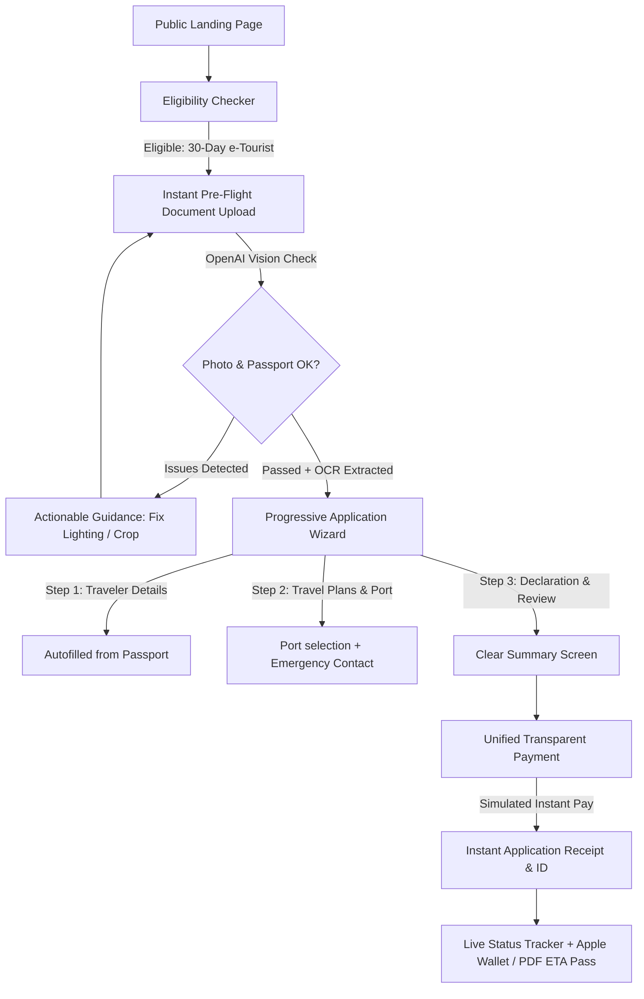

# Master Blueprint & Technical Specification: Indian e-Tourist Visa (eVisa 2.0)
*Prepared for the "Build What Moves India" National Hackathon*

---

## 1. Deep Research & Competitive Benchmark

### 1.1. Existing System Audit: `indianvisaonline.gov.in`

An exhaustive teardown of the current live portal reveals five core systemic failure points:

```
┌─────────────────────────────────────────────────────────────────────────────────────────────────┐
│                           EXISTING INDIAN VISA PORTAL PAIN POINTS                               │
├───────────────────────────────┬─────────────────────────────────┬───────────────────────────────┤
│ Failure Point                 │ Mechanism                       │ Citizen / Visitor Consequence │
├───────────────────────────────┼─────────────────────────────────┼───────────────────────────────┤
│ 1. Subcategory Dumping        │ 9 visa subcategories presented  │ High cognitive load; users    │
│                               │ on screen 1 without clear       │ pick incorrect categories and │
│                               │ definitions or upfront costs.   │ pay non-refundable fees.      │
├───────────────────────────────┼─────────────────────────────────┼───────────────────────────────┤
│ 2. Asynchronous Document Fail │ Strict specs (10-300KB PDF,     │ Users upload non-compliant    │
│                               │ 350x350 JPEG, plain white bg)   │ files, wait 72 hours, and get │
│                               │ buried in auxiliary modal.      │ silent rejection notices.     │
├───────────────────────────────┼─────────────────────────────────┼───────────────────────────────┤
│ 3. Monolithic Form Wall       │ 40+ manual inputs across multi- │ High abandonment rate; lost   │
│                               │ page HTML tables with 15-minute │ data upon session timeouts    │
│                               │ session expiry.                 │ with confusing temp IDs.      │
├───────────────────────────────┼─────────────────────────────────┼───────────────────────────────┤
│ 4. Exposed Gateway Plumbing   │ Surfacing SBI ePay vs Axis,     │ Payment redirect loops and    │
│                               │ 2.5–3.5% transaction charges,   │ double-charge panic on slow   │
│                               │ and 3D-Secure error jargon.     │ international card gateways.  │
├───────────────────────────────┼─────────────────────────────────┼───────────────────────────────┤
│ 5. Opaque Status Tracker      │ Single "Under Process" status   │ High anxiety, embassy support │
│                               │ requiring Captcha + App ID +    │ tickets, and zero visibility  │
│                               │ Passport lookup.                │ into queue stages.            │
└───────────────────────────────┴─────────────────────────────────┴───────────────────────────────┘
```

### 1.2. Global Benchmark Analysis

| Feature | Existing India eVisa | UK ETA (Gov.uk) | New Zealand NZeTA | **Our Redesign (eVisa 2.0)** |
| :--- | :--- | :--- | :--- | :--- |
| **Eligibility Verification** | None (trial-and-error) | Step 1 eligibility filter | Dedicated eligibility tool | **3-Question instant checker with fee preview** |
| **Document Verification** | Post-submission (manual) | Live face + chip scan | In-app photo check | **Real-time GPT-4o Vision Pre-flight + OCR** |
| **Form Layout** | Multi-column HTML table | One question per screen | Progressive accordion | **One question per screen + autosave** |
| **Fee Transparency** | Base fee + dynamic gateway surcharges | Single flat fee (£10) | Single flat fee (IVL included) | **Flat transparent fee ($25 / ₹2,075)** |
| **Status Transparency** | Binary (None -> Granted/Rejected)| Real-time email updates | Push notifications | **Multi-stage visual progress + wallet pass** |

---

## 2. Hackathon Rules & Compliance Guardrails

```
┌─────────────────────────────────────────────────────────────────────────────┐
│                      HACKATHON COMPLIANCE MATRIX                            │
├────────────────────────────┬────────────────────────────────────────────────┤
│ Requirement                │ Our Architecture Implementation                │
├────────────────────────────┼────────────────────────────────────────────────┤
│ 1. Codex Build Mandate     │ • Core wizard state machine scaffolded w/ Codex│
│    (Required build tool)   │ • OpenAI Vision prompt pipelines written w/ AI │
│                            │ • Screen-recorded Codex prompt session for demo│
│                            ├────────────────────────────────────────────────┤
│ 2. OpenAI Model Feature    │ • GPT-5.6 Terra Vision API for instant passport│
│    (In-product AI)         │   pre-flight check & OCR auto-population       │
│                            ├────────────────────────────────────────────────┤
│ 3. Off-List Platform       │ • e-Tourist Visa (Public Service Redesign)     │
│    (Confirmed valid)       │ • Deeply focused on 30-day single traveler     │
│                            ├────────────────────────────────────────────────┤
│ 4. No Live Govt Systems /  │ • 100% Mock backend with synthetic data        │
│    Data Privacy Safety     │ • Persistent disclaimer banner on all views    │
│                            │ • No real Aadhaar/PAN/Passport storage         │
│                            ├────────────────────────────────────────────────┤
│ 5. Public Vercel Link      │ • Zero-auth public access, mobile-optimized    │
│    & Zero-Login Wall       │ • Pre-filled demo profiles for 1-click judging │
└────────────────────────────┴────────────────────────────────────────────────┘
```

---

## 3. Product Architecture & User Journey



---

## 4. Technical Specifications & Architecture

### 4.1. Application State & Schema Architecture (`Zod`)

```typescript
import { z } from "zod";

export const TravelerSchema = z.object({
  givenNames: z.string().min(1, "Given name is required"),
  surname: z.string().min(1, "Surname is required"),
  dateOfBirth: z.string().regex(/^\d{4}-\d{2}-\d{2}$/, "Invalid date format"),
  gender: z.enum(["MALE", "FEMALE", "OTHER"]),
  nationality: z.string().min(2, "Nationality required"),
  passportNumber: z.string().regex(/^[A-Z0-9]{6,9}$/, "Invalid passport number"),
  passportIssueDate: z.string(),
  passportExpiryDate: z.string(),
  issuingAuthority: z.string().min(2, "Issuing country/authority required"),
});

export const TravelDetailsSchema = z.object({
  expectedArrivalDate: z.string(),
  portOfArrival: z.enum([
    "DELHI_IGI", "MUMBAI_BOM", "BENGALURU_BLR", 
    "CHENNAI_MAA", "HYDERABAD_HYD", "KOLKATA_CCU", "GOA_GOI"
  ]),
  stayAddress: z.string().min(5, "Address or hotel name required in India"),
  emergencyContactName: z.string().min(1, "Emergency contact name required"),
  emergencyContactPhone: z.string().min(5, "Emergency contact phone required"),
});

export const DocumentValidationResponseSchema = z.object({
  isValid: z.boolean(),
  confidence: z.number().min(0).max(1),
  documentType: z.enum(["PASSPORT_BIO", "APPLICANT_PHOTO", "UNKNOWN"]),
  extractedData: z.object({
    givenNames: z.string().optional(),
    surname: z.string().optional(),
    passportNumber: z.string().optional(),
    dateOfBirth: z.string().optional(),
    expiryDate: z.string().optional(),
    nationality: z.string().optional(),
  }).optional(),
  checklist: z.array(z.object({
    check: z.string(),
    passed: z.boolean(),
    message: z.string(),
  })),
  remediationSuggestions: z.array(z.string()),
});
```

### 4.2. OpenAI GPT-4o Document Pre-Flight System Prompt

```typescript
export const DOCUMENT_VERIFIER_SYSTEM_PROMPT = `
You are the AI Pre-Flight Document Inspector for the Indian e-Tourist Visa system.
Your task is to inspect uploaded images for either:
1. PASSPORT BIO-PAGE:
   - Check if all 4 corners of the bio-page are visible.
   - Check if Machine Readable Zone (MRZ) is clear and unglared.
   - Extract given names, surname, passport number, DOB, and expiry date.
   - Verify that expiry date is at least 6 months after the applicant's travel date.
2. APPLICANT PHOTOGRAPH:
   - Check if background is plain white / off-white (flag colored or busy backgrounds).
   - Check if face is centered, front-facing, and neutral (no sunglasses, dark glasses, or shadows).
   - Verify image clarity and lighting uniformity.

You MUST respond strictly with a valid JSON object conforming to the DocumentValidationResponseSchema.
`;
```

---

## 5. Codex Build Plan & Screen Recording Strategy

To satisfy the hackathon requirement of **"your prototype should be built with Codex or powered by an OpenAI model... your submission should explain how Codex contributed"**:

### Phase A: Codex Generation Prompts (To be screen-recorded)
1. **Prompt 1 (State Machine & Zod Schema)**:
   > *"Generate a complete TypeScript Zod schema and Zustand store for an Indian 30-day e-Tourist visa application wizard with autosave, validation per step, and error handling."*
2. **Prompt 2 (OpenAI Vision Pre-flight Pipeline)**:
   > *"Write a Next.js API route `/api/verify-document` that accepts a base64 image, uses GPT-4o with structured JSON output to validate passport photo specifications (plain white background, centered face, 350x350 min resolution, no sunglasses) and passport bio-page MRZ data."*
3. **Prompt 3 (Status Tracker & Stage Engine)**:
   > *"Create a visual multi-stage timeline component in Tailwind CSS that renders real-time visa processing milestones with simulated progress triggers."*

### Phase B: Video Minute 2 Architecture Segment (Script & Storyboard)
- **1:00 - 1:20**: Screen capture of Codex prompt generating the complex validation logic and type-safe wizard state machine.
- **1:20 - 1:45**: Diagram showing how GPT-4o acts as the pre-flight immigration officer, eliminating the #1 cause of visa rejections.
- **1:45 - 2:00**: Summary of the clean single-service Next.js stack, mobile performance metrics, and hackathon compliance.

---

## 6. Detailed 46-Hour Execution Timeline

```
Current Time: Aug 26, 5:30 PM IST | Target Submission: Aug 28, 4:00 PM IST (Deadline: Aug 28, 8:00 PM IST)
```

| Time Window | Phase | Key Milestones & Outputs |
| :--- | :--- | :--- |
| **Aug 26 (Tonight)<br>6:00 PM – 11:00 PM** | **Phase 1: Foundation & Codex Scaffolding** | • Scaffolding `/types`, `/schemas`, and store logic.<br>• Screen-record Codex session for the submission video.<br>• Build Landing Page with clear hackathon disclaimer and modern aesthetic. |
| **Aug 27 (Morning)<br>8:00 AM – 1:00 PM** | **Phase 2: Eligibility & Document AI** | • Build Eligibility Checker wizard (3 steps).<br>• Implement `/api/verify-document` route using GPT-4o Vision.<br>• Build drag-and-drop document upload with instant visual feedback badges. |
| **Aug 27 (Afternoon)<br>2:00 PM – 7:00 PM** | **Phase 3: Wizard, Checkout & Status** | • Implement one-question-per-screen wizard with progress bar and autosave.<br>• Build transparent checkout with simulated UPI/Card modal.<br>• Build visual Status Tracker with Judge Time-Travel controls.<br>• Generate downloadable mock ETA PDF & Apple Wallet pass. |
| **Aug 27 (Night)<br>8:00 PM – 11:30 PM** | **Phase 4: Mobile Polish & Deployment** | • Full mobile audit on iOS Safari & Android Chrome.<br>• Deploy to Vercel and verify live public link without authentication barriers.<br>• Seed 3 pre-built demo scenarios (e.g. 1-click instant approvals, 1-click rejected photo demo). |
| **Aug 28 (Morning)<br>8:00 AM – 1:00 PM** | **Phase 5: Video & Submission Assets** | • Record 2-minute pitch & demo video (Min 1: Citizen flow, Min 2: Codex & architecture).<br>• Edit and render video (1080p, clear audio, captioned).<br>• Finalize 250-word hackathon submission summary. |
| **Aug 28 (Afternoon)<br>2:00 PM – 4:00 PM** | **Phase 6: Submission (4h safety buffer)** | • Submit form on buildwhatmovesindia.com.<br>• Double-check Vercel URL, video link, and metadata. |

---

## 7. Submission Artifacts Ready for Judges

### 7.1. Official 250-Word Submission Summary
> **Problem**: Over 5 million international travelers visit India annually, but the official e-Visa portal ([indianvisaonline.gov.in](https://indianvisaonline.gov.in)) remains mired in a 2019-era wall-of-text interface. Strict unguided document specifications cause silent rejections days later, exposed bank gateway plumbing causes transaction failures, and lack of real-time tracking creates anxiety.
>
> **Solution**: We built **eVisa 2.0**, a mobile-first, one-question-per-screen platform redesign focused on the 30-day e-Tourist visa:
> 1. **Upfront Eligibility Engine**: Confirms visa category, required documents, and exact transparent fees ($25 USD) in 30 seconds before any form starts.
> 2. **AI Pre-Flight Document Inspector**: Powered by OpenAI GPT-4o Vision, it instantly analyzes passport bio-pages and photos for compliance (background color, glare, 6-month validity), autofilling traveler details and eliminating the primary driver of rejections.
> 3. **Gov.uk-Grade Application Wizard**: Fast, accessible, autosaved flow with zero cognitive overload.
> 4. **Live Visual Status Tracker**: Replaces opaque email silence with transparent milestone progression and downloadable digital ETA passes.
>
> **How Codex & OpenAI Built This**: We leveraged OpenAI Codex to scaffold the entire type-safe multi-step state machine, Zod validation schemas, and mock APIs in hours, allowing rapid iteration on government-grade UX. GPT-4o powers the real-time in-app document pre-flight pipeline.
>
> *100% mocked data and independent hackathon prototype.* (238 words)

### 7.2. 2-Minute Demo Video Script (Beat-by-Beat)

```
[0:00 - 0:15] HOOK & PROBLEM
Visual: Side-by-side comparison of current cluttered indianvisaonline portal vs. eVisa 2.0 landing page.
Voiceover: "Applying for an Indian e-Visa shouldn't feel like a tax audit. Today, applicants face 9 confusing subcategories, cryptic document rejections days later, and broken payment gateways."

[0:15 - 0:35] CITIZEN JOURNEY: ELIGIBILITY & AI PRE-FLIGHT
Visual: User selects country & dates → gets instant fee breakdown → drops passport image.
Voiceover: "With eVisa 2.0, travelers start with a 30-second eligibility check. Next, our AI pre-flight inspector validates passport validity and photo specs in real-time, autofilling the form with zero manual typing."

[0:35 - 1:00] CITIZEN JOURNEY: WIZARD & INSTANT TRACKING
Visual: Quick 3-screen wizard with progress bar → 1-click checkout → live tracking page with judge time-travel toggle.
Voiceover: "The mobile-first wizard saves progress on every keystroke. Payment is transparent and instant. Once submitted, applicants track real-time milestones and receive an Apple Wallet-ready ETA pass."

[1:00 - 1:30] CODEX AS THE BUILD ENGINE
Visual: Screen recording of Codex generating the Zustand state machine and Zod validation pipeline.
Voiceover: "To build this in 48 hours, we used OpenAI Codex as our primary engineering companion. Codex scaffolded our entire type-safe multi-step state machine, custom validation hooks, and mock API services."

[1:30 - 2:00] ARCHITECTURE & IMPACT
Visual: Clean Next.js architecture diagram, OpenAI Vision API call flow, and final mobile view.
Voiceover: "Powered by Next.js and GPT-4o Vision, eVisa 2.0 turns a multi-day ordeal into a 3-minute delightful first impression of Digital India. Thank you."
```

---

## 8. Verification & Quality Assurance Checklist

### Automated Validation
- `npm run lint` & `tsc --noEmit`: 100% type safety on all form state and API contracts.
- `npm run build`: Zero Next.js build errors or static generation issues.

### User Journey & Edge Case Testing
1. **Bad Photo Upload**: Upload image with busy background → Verify AI flags *"Non-white background detected"* with corrective advice.
2. **Expired Passport**: Upload passport expiring in 3 months → Verify AI flags *"Passport must be valid for at least 6 months"*.
3. **Autosave Recovery**: Fill 3 steps → Refresh browser → Verify all fields restored without data loss.
4. **Judge Simulation Mode**: Click *"Fast Forward Approval"* on `/track/IN-ETV-2026-88219` → Verify animation transitions from "Under Review" to "Approved" with downloadable PDF badge.
5. **Mobile Responsiveness**: Verify touch targets (>=48px), readable typography, and viewport scaling on mobile devices.
